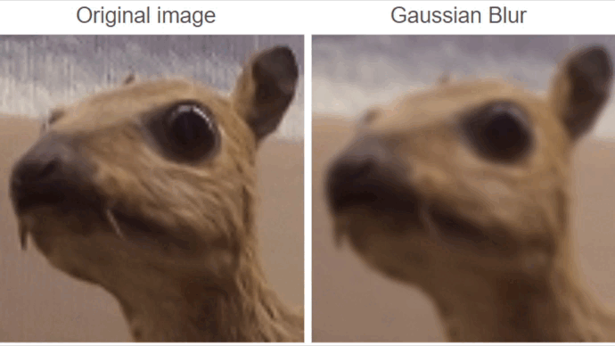

# Piximago

Piximago is an image processing application which offers the user a fairly simple interface for carrying out real time image processes with, for example, image denoising methods using Fourier transform.

## 1 - Demonstration

https://github.com/gdubrasquetd/Piximago/assets/58482474/1689eff9-7928-483f-af44-2e89d10a31de

## 2 - Installation 

### 2.1 - Requirements

Piximago application was developed using the C language and the Qt API, release 5.15.3, on a Linux environment. Here is a list of the libraries used to complete this project :

* QMake : 3.1
* GNU Make : 4.3
* C++ : 11.4.0

* imago2 from libimago
* lib fftw3 : 3.3.8

### 2.2 - Installation

To install and compile the Piximago application, here are the commands to run in a terminal : 
```
git clone https://github.com/gdubrasquetd/Piximago.git
make
```

Once you have compiled the source code, you can launch the application with the following executable : 
```
./Piximago-shortcut
```


## 3 - Use Cases / Applications

To develop this application, an architectural choice was made to divide the project into two independent parts : 

* Domain : developed in C using libimago and fftw. This section enables to carry out image processing which are all totally independent and can be executed singly by command lines (using utils.h and fft.h).
* Interface : developed in C++ using Qt. This section contains the visual part of the application. This part is linked to the Domain directly by calling command lines, so  it can be used completely independently just by changing those command lines.

This choice of composition is justified by the fact that it is possible to modify one of the two parts of the code without enfluencing the second. Moreover, the image processing code is thus fully usable in command line, whereas the code for the interface can be reused.


### 3.1 - Software interface


First of all, there is a menu bar in two menus. The first one, "File", contains "Open" action, to open an image, and "Save" action, to save a result image generated from processing steps.
Warning : only some formats are accepted by the software : png, jpg, jpeg. 


<figure id="fig1">
    
  <figcaption><b>Software with an opened image</b></figcaption>
</figure>
<br/>

When you open an image, its representation is displayed twice on the right-hand side of the interface : original image (<a style="color: red;" href="#fig1">1</a>) to the top and a preview (<a style="color: red;" href="#fig1">2</a>) of the result image below. This preview  apply the modifications in real time according to the values selected by the user.

On the left, there is the interface's main control panel (<a style="color: red;" href="#fig1">3</a>). At the top of it there is a combobox (<a style="color: red;" href="#fig1">a</a>) which allow the user to select an image processing method. Below there is the parameter zone (<a style="color: red;" href="#fig1">c</a>) where you can interact with sliders, radio buttons or spin box according to the different image processing methods available. Those parameters can be put back to their default values using the button "Reset Parameters" (<a style="color: red;" href="#fig1">b</a>). Each modification can be saved using the "Confirm changes" button (<a style="color: red;" href="#fig1">d</a>), which apply the preview's modifications and create a control point of processing modifications.

 The "Edit" menu allows you to modify these changes. Indeed, you can simply "Undo" or "Redo" a processing step to recover the previous or next image whose changes you've confirmed. In the "Edit" menu you can as well display the masks and the spectrums that are used during spectral processing. It open a window which display the spectrum or the mask for each RGB channel of the image which are getting updated in real time.
 

### 3.2 - Processing methods 

#### Colorimetry

This method allows to adjust the colorimetry of the image by modifying the amount of Red, Green and Blue in it. To do that, the method multiply the RGB value of each pixel of the image by the percents values given using the sliders.

##### Parameters :

<figure>
    
</figure>
<br/><br/><br/><br/><br/><br/>
- Red values of the image are multiplied by a factor from 0% to 200%
<br/><br/><br/><br/>
- Green values of the image are multiplied by a factor from 0% to 200%
<br/><br/><br/><br/>
- Blue values of the image are multiplied by a factor from 0% to 200%
<br/><br/><br/><br/><br/><br/>

#### Balance

This method to adjusty the contrast and the brightness of the image. For the constrast, the method apply this formula to each pixel with $factor$ as the percent value of the slider.
$R[i] =(R[i]−\dfrac{R[i]+G[i]+B[i]}{3})×factor+\dfrac{R[i]+G[i]+B[i]}{3}$ 

 For the brightness, it's simply adding the value of the slider to each pixel.

##### Parameters :

<figure>
    
</figure>
<br/><br/><br/><br/><br/><br/><br/><br/><br/>
- Contrast of the image from 0% to 1000%
<br/><br/><br/><br/>
- Brightness of the image is modified by adding from -255 to 255 to all values of each color channel
<br/><br/><br/><br/><br/>

<br/><br/>

#### Convolution

This method applies convolution effects to the image. To do that the function adds a zero padding around the image et then apply the select convolution kernel on this image to produce the result image. The different kernels are listed behind.

<figure>
    
</figure>

##### Parameters :

<figure>
    
</figure>
<br/><br/>
<figure>
    
</figure>
<br/><br/>

#### Cross

This method is cleaning some frequential noises. By using a Fourier transform, the method extract the amplitude spectrum of the image and then apply a mask on it. This mask is composed of vertical and horizontal lines configured by the user. After that, we apply the mask on the spectrum and recompose the image with the modified spectrum and denoised the masked frequencies.

<figure>
    
</figure>

##### Parameters :

<figure>
    
</figure>
<br/><br/><br/><br/><br/>
-Thickness of the lines
<br/><br/><br/>
-Void space left in the middle of the lines
<br/><br/><br/><br/>
-Crossing lines, vertical line or horizontal line
<br/><br/><br/><br/>
-Position of the line in percent of the image's width or height
<br/><br/><br/><br/>
<br/>

#### Band

This method is cleaning some frequential noises. By using a Fourier transform, the method extract the amplitude spectrum of the image and then apply a mask on it. This mask is a circular band configured by the user. After that, we apply the mask on the spectrum and recompose  the image with the modified spectrum and denoised the masked frequencies.

<figure>
    
</figure>

##### Parameters :

<figure>
    
</figure>
<br/><br/><br/><br/><br/>
-Min value of the band in percent of the normalized dimensions of the image
<br/><br/><br/><br/>
-Max value of the band in percent of the normalized dimensions of the image
<br/><br/><br/><br/><br/>
-Exclude values out of the band or include values out the band
<br/><br/><br/><br/><br/><br/>
<br/>

#### Stain

This method is cleaning some frequential noises in an image. By using a Fourier transform, the method extract the amplitude spectrum of each RGB channel of the image and then create a mask for it. This mask is different for each channel and is targeting specific frequential noises by detecting isolated light stains on spectrum. To do that, we firstly create the cumulated histogram of each channel and let the user choose the percent of values he wants to filter. Thanks to that, we got a threshold that we apply to the spectrum value and mask pixels that are above it. Then we apply dilatation and erosion on this mask which the radius is chosen by the user. Finally, we delete the central stain of the mask by browsing pixels of the mask directly linked to the center. After that, we apply the mask on the spectrum and recompose the image with the modified spectrum and denoised the masked frequencies.

<figure>
    
</figure>

##### Parameters :

<figure>
    
</figure>

<br/><br/><br/><br/>
-Treshold on Red channel based on a percent of the cumulative histogram
<br/><br/><br/><br/>
-Treshold on Red channel based on a percent of the cumulative histogram
<br/><br/><br/><br/>
-Treshold on Red channel based on a percent of the cumulative histogram
<br/><br/><br/><br/>
-Radius use for the dilatation and the erosion
<br/><br/><br/><br/><br/>


#### Resize

As its name suggets, this method is resizing the image to the given dimensions. To do that the function use a bilinear interpolation.


## 4 - Contributors

This project is realized by Guillaume Dubrasquet-Duval and Lilian Rebiere-Pouyade.

## 5 - License

Copyright (C) 2023 Guillaume Dubrasquet-Duval and Lilian Rebiere-Pouyade
GNU Lesser General Public License (LGPL) Version 3
